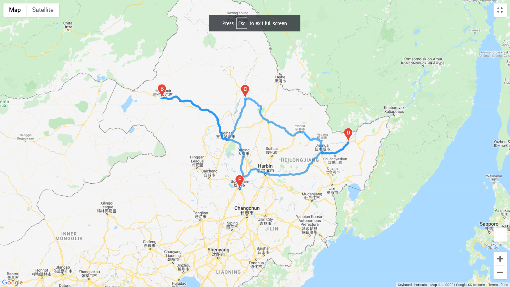
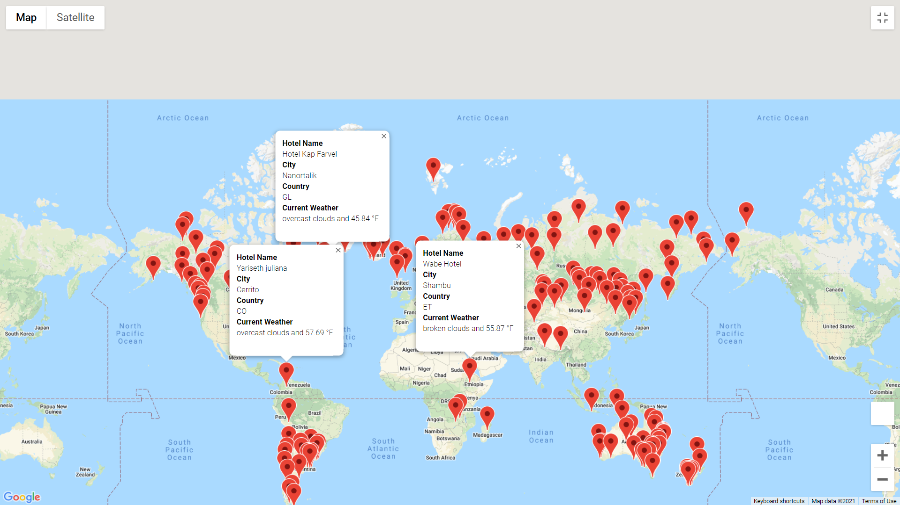

# World_Weather_Analysis

## Purpose

This Analysis is about creating a vacation map to help customers Plan for their Trip and get the information and data  , also provides users the weather description for over 500 cities across the world and creating travel destinations and itinerary map
 
 
 ## Overview
 
 
 
 
1. We did generate  a list of 1,500 random latitudes and longitudes. With the coordinates,by using  the OpenWeatherMap API .
2. We have used  citipy module  to identify the nearest city for each coordinate combination. 
3. We did  request the current weather data from each unique city on the list  through  the OpenWeatherMap API.
4. The map provides users with information about  about hotel name, city, country, and current weather and the destinations .
5. We did use  Google Maps Directions API to generates a travel route between 4 cities 

 

## Results

This App Makes Traveling Easier and more accurate based on the information that was given  these informations provides users with descriptions of the weather, city and destination and hand over users  different options  such as  Forecast information ,Hotels and the location 
